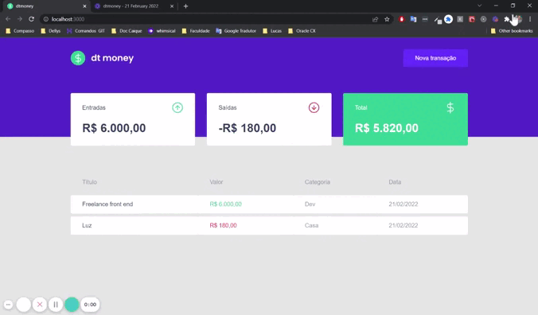

<h1><strong>My Finances - Web</strong></h1>

 
 
<strong><h2>🎯 Sobre</h2></strong>

A proposta desse desenvolvimento consiste na implementação de um sistema web simples para que se possa calcular suas finanças na web.

 
 <strong><h2>🛠️ Tecnologias usadas</h2></strong>

[<li> <strong>React JS</strong></li>](https://pt-br.reactjs.org/)
[<li> <strong>TypeScript</strong></li>](https://www.typescriptlang.org/)
[<li> <strong>Styled Components</strong></li>](https://styled-components.com/)
[<li> <strong>Mirage JS</strong></li>](https://miragejs.com/)
[<li> <strong>Axios</strong></li>](https://axios-http.com/docs/intro)

 
<strong><h2>⚙️ Instalação</h2> </strong>

<strong>🔙 Pré-requisito </strong>

Antes de começar, você precisará ter instalado em seu computadore as seguintes ferramentas: [Git](https://git-scm.com/) , [Node.js](https://nodejs.org/en/) e [Yarn](https://yarnpkg.com/) .
Além disso, é bom ter um editor para trabalhar com seu código, como o [VSCode](https://code.visualstudio.com/).

 

<strong>🔽 Clonando o repositório </strong>

<pre>via HTTPS
$ git clone https://github.com/realcaldeira/movies.git </pre>

<strong>🖥️ Iniciando o aplicativo</strong>

<pre>
# Acesse a pasta com comando <strong>cd </strong> 

# Volte para a pasta anterior do aplicativo 
$ cd ..

# Instale as dependências
$ yarn

# Inicie o projeto
$ yarn start

Este projeto foi feito com ❤ por Lucas Caldeira
</pre>

